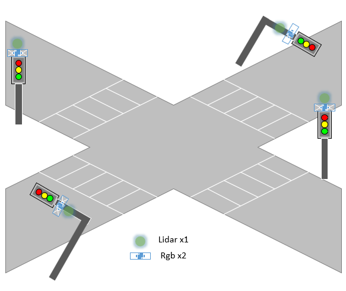

# Multi-V2X: A Large Scale Multi-modal Multi-penetration-rate Dataset for  Cooperative Perception

For data collection by CARLA-SUMO co-simulation, the code is integreted in https://github.com/RadetzkyLi/CoRTSG .

For generation of sub-dataset with specific CAV penetration rate (obtain the pr config), see `Multi-V2X/scripts/vary_pr.ipynb` .

For training and testing of cooperative perception algorithms, the code is integreted in 
https://github.com/RadetzkyLi/OpenCOOD .

The arxiv paper is published [here](https://arxiv.org/abs/2409.04980).

**Multi-V2X** is a **large-scale**, **multi-modal**, **multi-penetration-rate** dataset for **cooperative perception** under vehicle-to-everything (**V2X**) environment. Multi-V2X is gathered by SUMO-CARLA co-simulation and supports tasks including 3D object detection and tracking. Multi-V2X provides RGB images, point clouds from CAVs and RSUs with various CAV penetration rates (up to 86.21%).

**Features**:
- **Multiple Penetration Rates**: nearly all cars in a town are equipped with sensors (thus can be CAV). By masking some equipped cars as normal vehicles, datasets of various penetration rates can be generated.
- **Multiple Categories**: **6** categories: car, van, truck, cycle, motorcycle, pedestrian, covering the common traffic participants. As comparison, the well-know OPV2V, V2XSet and V2X-Sim contain only car. 
- **Multiple CAV Shapes**: all kinds of cars in CARLA can be CAVs, whereas only lincoln in OPV2V and V2XSet.
- **Multiple Modalities**: RGB images and point clouds from CAVs and RSUs are provided.
- **Dynamic Connections**: CAVs are spawned and running in the whole town and thus connections would be lost and created over time. This is more realistic compared to spawning and running vehicles around a site.

---

## Data Collection

### Maps

Currently, we consider Town01, Town03, Town05, Town06, Town07, Town10HD. These towns cover a variety of road types, e.g, road segment, mid-block, T-junction, crossroad, rural road, etc.

### Sensors

The **agents** are equipped with various sensors to capture surrounding environment.  By now, cars and road side unit (RSU) are considered as agent (truck, motorcycle, etc., are excluded). All sensors stream at 20Hz but record at **10Hz**.

#### CAV

One CAV is equipped with the following **7** sensors:

- **RGB camera x 4**: 110° FOV, 800x600 resolution, position: top of the car, pose: front, rear, left, right.

- **LiDAR x1**: 120 m detection range, 64 channels, 130,0000 points per second, 40° vertical FOV (-30 ~ 10), 20Hz rotation frequency.

- **Semantic LiDAR x1**: same as LiDAR

- **GNSS**: 0.02m error


#### RSU

One RSU is equipped with the following **5** sensors:

- **RGB camera x 2**: 110° FOV, -15° pitch, 800x600 resolution, position: top of the traffic light, pose: forward, backward

- **LiDAR x 1**: 120m detection range, 64 channels, 130,0000 points per second, 40° vertical FOV (-40 ~ 0), 20Hz rotation frequency.

- **Semantic LiDAR x 1**: same as LiDAR

- **GNSS**: 0.02m error

Depending on the shape of traffic lights, sensors will be mounted at different positions. If traffic light stands on road side, sensors are mounted at its top of height of 14 feet. If traffic light hang over the roadway, sensors are mounted at that location of height of 14 feet. Similar to DAIR-V2X, only one traffic lights are selected as RSU.

**Notes**: All signalized junctions have one and only one RSU.



---

## Summary

**agents**: 410 CAVs, 56 RSUs.

**6 categories**: car, van, truck, pedestrian, cycle, motorcycle.

**period**: an episode of 30s after the traffic flow reaches a relative stable state. 

**communication**:  By default, the communication range is **70m**. 

**connections**: number of total agents in one's communication range (excluding itself). In a frame, #conn of an agent range from 0 to 31, i.e., connecting with **0** to **31** other agents. On average, a CAV/RSU can connect with **9.913/9.276** other agents in a frame when all equipped cars as CAVs.

**CAV penetration rate**: the percentage of CAVs in all motor vehicles on the road. In each map, part of cars are equipped with sensors to record environmental information. One can select some of them as CAVs to realize various CAV penetration rates. The max penetration rate over maps varys from **55.17%** to **86.21%**. 

**distance travelled**: 12.698 km for pedestrians, **53.681 km** for equipped cars, 117.935 km for all.

**Summary of Multi-V2X**
| Map      | #CAV | #RSU | #frame  | #bbox     | #rgb    | #pcd    | max connections |
| -------- | ---- | ---- | ------- | --------- | ------- | ------- | -------- |
| Town01   | 50   | 12   | 17,711  | 504,528   | 63,544  | 17,711  | 17       |
| Town03   | 100  | 11   | 33,300  | 1,016,233 | 126,600 | 33,300  | 25       |
| Town05   | 80   | 15   | 28,500  | 1,211,518 | 105,000 | 28,500  | 27       |
| Town06   | 70   | 8    | 30,420  | 463,629   | 115,400 | 30,420  | 19       |
| Town07   | 60   | 5    | 19,565  | 371,219   | 75,250  | 19,565  | 22       |
| Town10HD | 50   | 5    | 16,500  | 651,847   | 63,000  | 16,500  | 31       |
| Overall  | 410  | 56   | 145,996 | 4,218,974 | 548,934 | 145,996 | 31       |

---

**Comparison with other datasets**
| Dataset              | Year | Type | V2X   | RGB Images | LiDAR | 3D boxes | Classes | Locations                                  | connections |
| -------------------- | ---- | ---- | ----- | ---------- | ----- | -------- | ------- | ------------------------------------------ | ----- |
| DAIR-V2X             | 2022 | Real | V2I   | 71k        | 71k   | 1200k    | 10      | Beijing, China                             | 1     |
| V2V4Real             | 2023 | Real | V2V   | 40k        | 20k   | 240k     | 5       | Ohio, USA                                  | 1     |
| RCooper              | 2024 | Real | I2I   | 50k        | 30k   | -        | 10      | -                                          | -     |
| OPV2V                | 2022 | Sim  | V2V   | 132k       | 33k   | 230k     | 1       | CARLA Town01, 02, 03, 04, 05, 06, 07, 10HD | 1-6   |
| V2XSet               | 2022 | Sim  | V2V&I | 132K       | 33K   | 230K     | 1       | Same as OPV2V                              | 1-4   |
| V2X-Sim              | 2022 | Sim  | V2V&I | 283K       | 47K   | 26.6K    | 1       | CARLA Town03, 04, 05                       | 1-4   |
| **Multi-V2X** (ours) | 2024 | Sim  | V2V&I | 549k       | 146k  | 4219k    | 6       | CARLA Town01,  03, 05, 06, 07,  10HD       | 0-31  |

**Note**: the data was counted per agent.

---
## Data Download

Download the data from [OpenDataLab](https://opendatalab.com/Rongsong/Multi-V2X) .

## Benchmarks

For lack of cooperative perception algorithms targeted for high CAV penetration rate, by now, we just conducted experiments on $\mathcal{D}^{\text{Multi-V2X}}_{\text{10\%}}$, a V2X dataset with 10% CAV penetration rate and 14932 frames (counted by 48 ego cars).

**Cooperative 3D object detection benchmarks on $\mathcal{D}^{\text{Multi-V2X}}_{\text{10\%}}$**
| Method        | AP@0.3 | AP@0.5 | AP@0.7 |
| ------------- | ----- | ----- | ----- |
| No Fusion     | 0.307 | 0.237 | 0.117 |
| Late Fusion   | 0.346 | 0.270 | 0.141 |
| Early Fusion  | 0.510 | 0.408 | 0.235 |
| V2X-ViT       | 0.440 | 0.350 | 0.228 |
| Where2comm    | 0.452 | 0.348 | 0.213 |

## Contact

If you have any questiones, feel free to open an issue or contact the author by [email](lirs17@tsinghua.org.cn). 

## Citation
If you find our work useful in your research, feel free to give us a cite:

```latex
@article{rongsong2024multiv2x,
      title={Multi-V2X: A Large Scale Multi-modal Multi-penetration-rate Dataset for Cooperative Perception}, 
      author={Rongsong Li and Xin Pei},
      year={2024},
      eprint={2409.04980},
      archivePrefix={arXiv},
      primaryClass={cs.CV},
      url={https://arxiv.org/abs/2409.04980}, 
}
```
